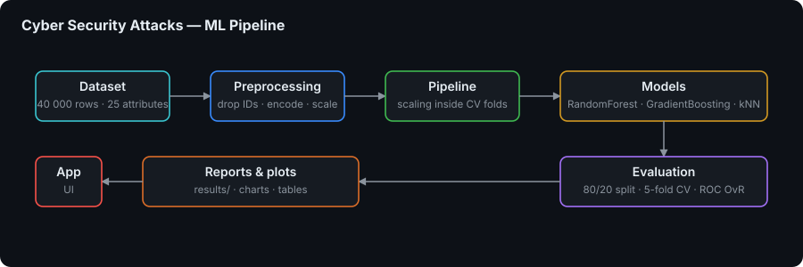

# Cyber Security Attacks Classifier

> 🚀 **End-to-end multiclass classification of network attacks** - a complete, reproducible ML pipeline from Kaggle download to interactive dashboard, with an honest reading of the results

A machine learning project that classifies network security events into three attack types — **DDoS**, **Malware** and **Intrusion** — using the [Cyber Security Attacks](https://www.kaggle.com/datasets/teamincribo/cyber-security-attacks) dataset from Kaggle. The primary model is a **Random Forest**; **Gradient Boosting** and **k-NN** are trained alongside it for comparison. A **Streamlit** dashboard walks through exploratory analysis, preprocessing, model design, comparison and evaluation.

The project deliberately reports what it actually found rather than what would look good. After identifiers and free-text fields are removed, the remaining tabular features carry little usable signal for `Attack Type` in this dataset — all three models land near the random baseline. The pipeline and metrics are correct; the finding is the result. See [Notes](#-notes).


---

## 🎯 Key Features

- 🎯 **Balanced three-class target** — `Attack Type` with **DDoS**, **Malware** and **Intrusion** at roughly one third each, over **40,000** instances and **25** attributes.
- 📥 **Automatic data acquisition** — `download_data.py` fetches the official CSV via [Kaggle Hub](https://github.com/Kaggle/kagglehub) into `data/cybersecurity_attacks.csv`, caching under `.kaggle_cache/`.
- 🔬 **Full EDA suite** — class distribution, missing-value profile, numeric and categorical distributions, a correlation heatmap and a **mutual-information** ranking against the target.
- ⚙️ **Documented preprocessing** — drops non-generalizing columns (timestamps, IPs, payload, geo/proxy data), converts sparse fields to binary presence flags, label-encodes categoricals, standard-scales numerics, then makes an 80/20 stratified split.
- 🌲 **Three models compared** — Random Forest (`n_estimators=200`, `class_weight="balanced"`), Gradient Boosting (`n_estimators=100`) and k-NN (`k=7`), each with 5-fold cross-validation.
- 📈 **Complete evaluation** — accuracy, macro F1, precision, recall, one-vs-rest ROC AUC, confusion matrices (counts and normalized), ROC curves and Random Forest feature importances.
- 🖥️ **Eight-tab Streamlit dashboard** — every stage of the study explorable, including an interactive feature explorer.
- ♻️ **One-command reproduction** — `./start.sh` (or `start.bat`) resolves Python, builds the venv, downloads data, runs the pipeline and opens the dashboard.

---

## 📊 Results & Visualizations


Running `python pipeline.py` regenerates every figure and metric into `results/` (git-ignored, see [Notes](#-notes)):

| Artifact | Content |
|---|---|
| `class_distribution.png` | Attack Type distribution with counts and percentages |
| `missing_values.png` | Missing values per column |
| `numeric_distributions.png` | Histograms for Source Port, Destination Port, Packet Length, Anomaly Scores |
| `categorical_distributions.png` | Eight categorical feature distributions |
| `correlation_heatmap.png` | Correlation across the numeric features |
| `mutual_information.png` | Mutual information with `Attack Type`, against a 0.01 threshold |
| `model_comparison.png` | Random Forest vs Gradient Boosting vs k-NN across five metrics, with the random baseline (0.333) marked |
| `confusion_matrix.png` | Random Forest confusion matrix, counts and normalized |
| `roc_curves.png` | One-vs-rest ROC curves per class |
| `feature_importance.png` | Random Forest feature importances |

Machine-readable counterparts are written beside them: `metrics.json`, `model_comparison.json`, `cv_scores.json`, `eda_summary.json`, `preprocessing_info.json`, `roc_data.json`, `feature_importance.json` and `confusion_matrix.npy`.

> Concrete numbers are intentionally not quoted in this README — read them from your own `results/metrics.json` after running the pipeline, and see [Notes](#-notes) for how to interpret them.

---

## 🏗️ Pipeline



```
download_data.py  →  pipeline.py  →  app.py
   Kaggle CSV        EDA, preprocessing,      Streamlit dashboard
   into data/        training, evaluation     reading results/ and models/
                     into results/, models/
```

### Stages in `pipeline.py`

1. **Load** — `ensure_dataset()` downloads the CSV if absent, then reads it with pandas.
2. **EDA** — six plot groups plus a mutual-information analysis, summarized to `eda_summary.json`.
3. **Preprocess** — drop ten non-predictive columns; convert `Malware Indicators` and `Alerts/Warnings` to binary presence flags; label-encode the target and remaining categoricals; `StandardScaler` on the four numeric columns; `train_test_split(test_size=0.2, random_state=42, stratify=y)`.
4. **Train** — Random Forest (primary) with 5-fold `cross_val_score`, plus Gradient Boosting and k-NN under the same protocol.
5. **Evaluate** — detailed Random Forest metrics, classification report, confusion matrices, OvR ROC curves and feature importances.

---

## 🧩 Modules

| Path | Purpose |
|------|---------|
| `download_data.py` | Download dataset from Kaggle into `data/` |
| `pipeline.py` | Full ML pipeline and evaluation |
| `app.py` | Streamlit dashboard |
| `description.md` | Detailed project description (Polish) |
| `data/` | Dataset CSV (generated; see `.gitignore`) |
| `results/` | Metrics, JSON, PNG plots, NumPy confusion matrix (generated) |
| `models/` | Saved `random_forest.joblib` (generated) |
| `start.sh` / `start.bat` | One-command setup + pipeline + Streamlit |

### Dashboard tabs (`app.py`)

| Tab | Content |
|---|---|
| 📋 **Project Overview** | Dataset description and the attribute table |
| 📊 **Exploratory Data Analysis** | Distributions, missing values, correlations, mutual information |
| ⚙️ **Preprocessing** | Dropped columns, encodings, scaling, split sizes |
| 🌲 **Model & Training** | Random Forest design and hyperparameters |
| ⚖️ **Model Comparison** | Random Forest vs Gradient Boosting vs k-NN |
| 📈 **Results & Evaluation** | Metrics, confusion matrix, ROC curves, feature importance |
| 🔍 **Interactive Explorer** | Scatter and distribution exploration over the raw features |
| ℹ️ **Informacje** | Supplementary notes |

---

## 🛠️ Technology Stack

### Machine Learning
- **scikit-learn** (`>=1.3`) — `RandomForestClassifier`, `GradientBoostingClassifier`, `KNeighborsClassifier`, `LabelEncoder`, `StandardScaler`, `train_test_split`, `cross_val_score`, `mutual_info_classif`, the full metrics suite
- **joblib** (`>=1.3`) — model persistence to `models/random_forest.joblib`
- **NumPy** (`>=1.24`) — numeric arrays and confusion-matrix export

### Data
- **pandas** (`>=2.0`) — loading, cleaning and aggregation
- **kagglehub** (`>=0.2`) — dataset download from Kaggle

### Visualization & UI
- **Matplotlib** (`>=3.7`) — all pipeline figures (Agg backend, headless-safe)
- **seaborn** (`>=0.13`) — heatmaps and confusion matrices
- **Plotly** (`>=5.18`) — interactive dashboard charts
- **Streamlit** (`>=1.30`) — the eight-tab dashboard

---

## 🚀 Getting Started

### Prerequisites

- **Python 3.10–3.13** (tested with 3.12; 3.14+ is not supported yet for this stack).
- Internet access on **first run** to download the dataset (~5 MB) unless `data/cybersecurity_attacks.csv` is already present.

### 1. Clone the Repository

```bash
git clone https://github.com/dawidolko/CyberAttack-Classifier-Python.git
cd CyberAttack-Classifier-Python
```

### 2. Install Dependencies

```bash
python3 -m venv venv
source venv/bin/activate          # Windows: venv\Scripts\activate
pip install -r requirements.txt
```

### 3. Run

#### One command (recommended)

**Linux / macOS**

```bash
chmod +x start.sh
./start.sh
```

**Windows** — double-click `start.bat` or run in `cmd` / PowerShell:

```bat
start.bat
```

The script will:

1. Resolve Python 3.10–3.13.
2. Create `venv/` if needed and `pip install -r requirements.txt`.
3. Run `python pipeline.py` (downloads data if missing, trains models, writes `results/`).
4. Start the Streamlit app at **http://localhost:8501** (`streamlit run app.py`).

Stop the server with **Ctrl+C**.

#### Manual steps

```bash
python download_data.py           # optional; pipeline also downloads if needed
python pipeline.py
streamlit run app.py
```

---

## 📁 Project Structure

```
CyberAttack-Classifier-Python/
├── 📥 download_data.py        # Kaggle download via kagglehub
├── 🔬 pipeline.py             # Full ML pipeline: EDA, preprocessing, training, evaluation
├── 🖥️ app.py                  # Streamlit dashboard (8 tabs)
├── 📊 data/                   # Dataset CSV (generated, git-ignored)
│   └── README.md              # How the CSV is obtained
├── 📈 results/                # Metrics JSON, PNG plots, confusion matrix (generated)
├── 🤖 models/                 # random_forest.joblib (generated)
├── 🖼️ img/
│   ├── cyberattack-preview.png # Dashboard preview
│   └── logo.svg               # Sidebar logo
├── 📚 docs/
│   ├── diagrams/pipeline.svg  # Pipeline diagram
│   └── dokumentacja_do125148.docx
├── 📝 description.md          # Detailed project description (Polish)
├── 🚀 start.sh / start.bat    # One-command setup + pipeline + dashboard
├── 📦 requirements.txt
└── 📖 README.md
```

---

## 🎓 Academic report (Polish course outline)

For the *Sztuczna inteligencja* report, map sections as follows:

1. **Student data** — name, program, year, academic year (fill in manually).
2. **Course** — Artificial Intelligence (or your exact course title).
3. **Project topic** — Multiclass classification of cyber security attacks (Random Forest on Kaggle dataset).
4. **Problem characterization** — Supervised multiclass classification; balanced three-class target; network and security features with missing values in several columns.
5. **Number of instances** — 40,000.
6. **Attributes** — 25; use the table in the Streamlit *Project Overview* tab and the dataset documentation on Kaggle.
7. **Preprocessing** — Summarize steps from the *Preprocessing* tab / `preprocessing_info.json` (dropped columns, binary flags, encodings, scaling, split).
8. **Model design** — Random Forest (primary), plus Gradient Boosting and k-NN for comparison; hyperparameters as in the *Model & Training* tab and `pipeline.py`.
9. **Results** — Accuracy, macro F1, precision, recall, ROC AUC, confusion matrix, per-class metrics (`metrics.json` / dashboard).
10. **Conclusions** — Strengths of RF on this task, role of important features, limitations (e.g. label encoding of IPs removed; text fields dropped).

---

## 📌 Notes

- **Empirical performance:** On this Kaggle release, **test accuracy is often near the random baseline (≈1/3)** for balanced three-class prediction, and **ROC AUC is near 0.5**, with all three models behaving similarly. That is a valid **finding** for your report: after removing identifiers and free text, the remaining tabular features may carry **little usable signal** for `Attack Type` in this synthetic split. The pipeline and metrics are still correct; interpret results honestly in section *Wnioski* / *Conclusions*.
- **Git:** `venv/`, `.kaggle_cache/`, `data/cybersecurity_attacks.csv`, and generated `results/` / `models/` artifacts are listed in `.gitignore`. Clone the repo and run `./start.sh` to regenerate everything.
- **Kaggle authentication:** Public dataset download via `kagglehub` typically works without extra setup; if you hit auth errors, follow [Kaggle API credentials](https://www.kaggle.com/docs/api) and set `KAGGLE_USERNAME` / `KAGGLE_KEY` or place `kaggle.json` in `~/.kaggle/`.

---

## 📄 License

Dataset usage is subject to the [Kaggle dataset license](https://www.kaggle.com/datasets/teamincribo/cyber-security-attacks). This repository code is provided for educational use — see the [LICENSE](LICENSE) file.

---

## 👨‍💻 Author

Created by **[Dawid Olko](https://github.com/dawidolko)**

- **Website** — [dawidolko.pl](https://dawidolko.pl/)
- **LinkedIn** — [@dawidolko](https://www.linkedin.com/in/dawidolko/)
